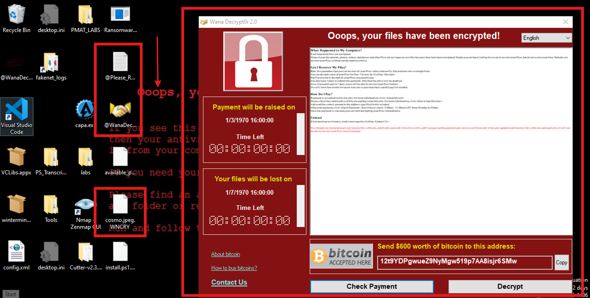
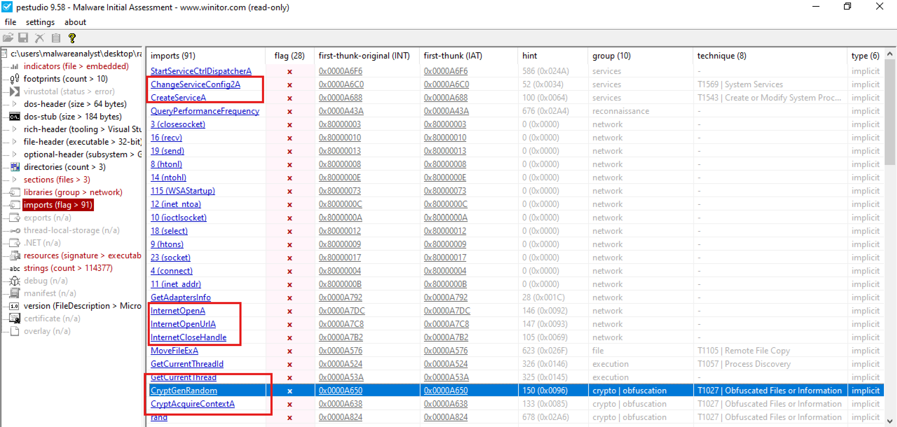
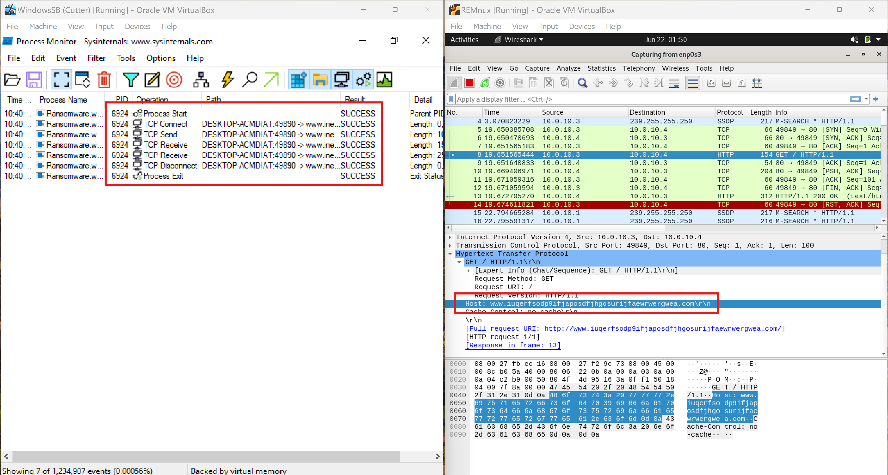
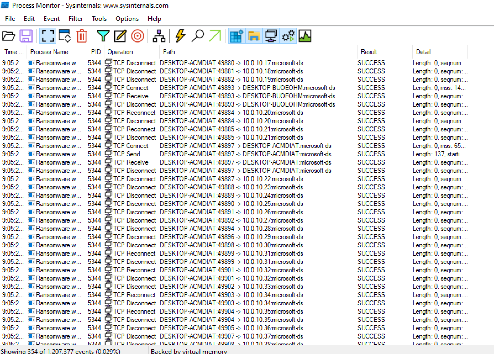
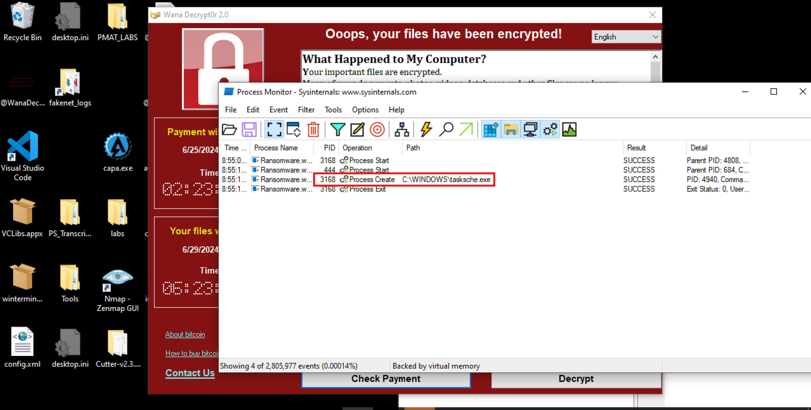
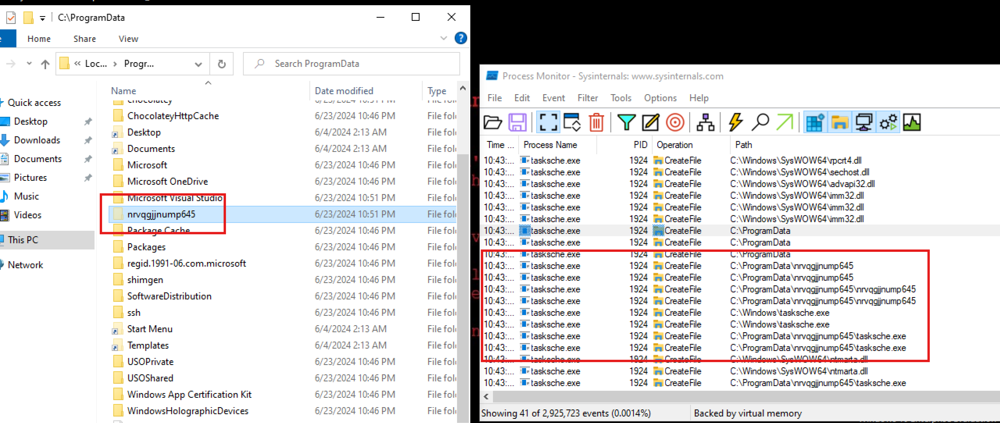
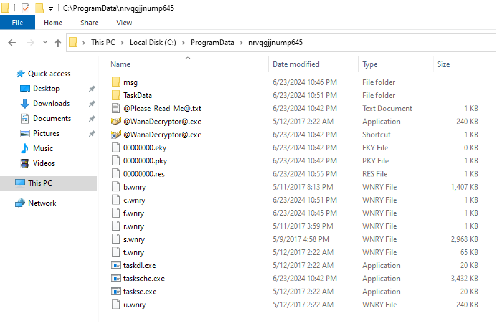
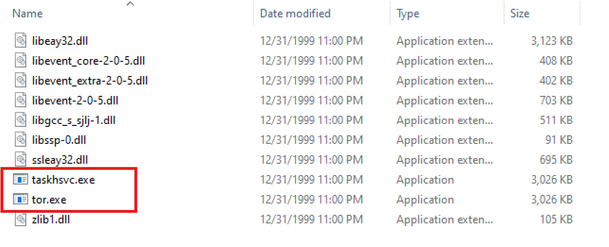
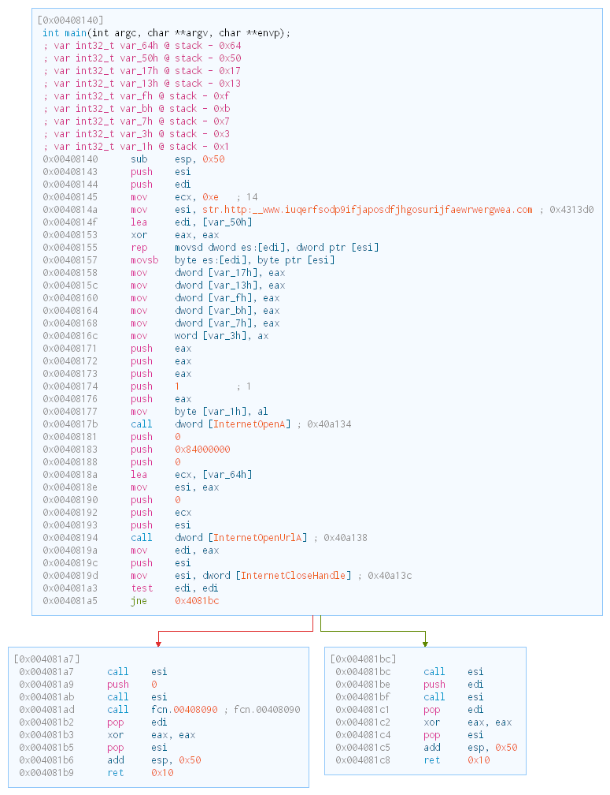

# Malware Analysis: WannaCry

## Overview

This project entails a comprehensive analysis of the WannaCry ransomware. The objective is to document the symptoms of infection, extract and analyze useful strings from the binary, inspect the import address table, identify detonation conditions, and determine network and host-based indicators. Additionally, the project involves examining the killswitch mechanism within the WannaCry binary.

## Initial Static Analysis

### Virustotal


### Capa


## Symptoms of Infection

When WannaCry infects a system, several symptoms are immediately observable:

- The wallpaper on the infected host is changed.
- A program window appears, indicating the host has been infected. This window includes a countdown timer and payment buttons.
- Files on the host's file system are encrypted, with the encrypted files having a `.WNCRY` extension.
- The presence of a `@WanaDecryptor@` executable and a `@Please_Read_Me` text file on the desktop.



## Extracted Strings

Using FLOSS to extract strings from the main WannaCry binary reveals several strings of interest:

- A notable URL built on the stack at runtime:
  ```
  hxxp[://]www[.]iuqerfsodp9ifjaposdfjhgosurijfaewrwergwea[.]com
  ```
- UNC paths that call to different remote shares:
  ```
  \\192.168.56.20\IPC$
  \\192.168.56.20\IPC$
  ```
- A series of language pack files located in a `msg` directory:
  ```
  msg/m_korean.wnry
  ```
- Additional strings of interest:
  ```
  %s -m security
  C:\%s\qeriuwjhrf
  tasksche.exe
  icacls . /grant Everyone:F /T /C /Q
  WNcry@2ol7
  ```


## Notable API Imports

The inspection of the import address table for the main WannaCry binary highlights several important API calls:

- [CryptGenRandom](https://malapi.io/winapi/CryptGenRandom)
- [CryptAcquireContextA](https://malapi.io/winapi/CryptAcquireContextA)
- [InternetOpenA](https://malapi.io/winapi/InternetOpenA)
- [InternetOpenUrlA](https://malapi.io/winapi/InternetOpenUrlA)
- [CreateServiceA](https://malapi.io/winapi/CreateServiceA)
- ChangeServiceConfig2A



## Conditions for Detonation

The WannaCry binary attempts to initiate a connection with the following URL:
```
  hxxp[://]www[.]iuqerfsodp9ifjaposdfjhgosurijfaewrwergwea[.]com
```
If a connection to this URL is not established, the ransomware payload is executed. If a connection is established, the program exits without executing the payload. Therefore, in a lab setting, INetSim must be turned off to detonate the sample.



## Network Indicators

The network indicators for this sample include:

- Attempted access to the unusual URL mentioned above.
- A flood of numerous SMB connection requests to non-private remote addresses.
  > **Note:** Non-private remote addresses refer to IP addresses outside the private IP ranges (10.0.0.0 to 10.255.255.255, 172.16.0.0 to 172.31.255.255, and 192.168.0.0 to 192.168.255.255). These are publicly routable addresses on the internet. The special address `0.0.0.0` is not considered non-private, as it represents all addresses in specific contexts like routing and server configurations.
  
  
- A secondary process, `taskhsvc.exe`, opens port 9050 to a LISTENING state and attempts to connect to 0.0.0.0 over HTTPS.
  
  

## Host-based Indicators

Host-based indicators for this sample include:

- Creation of a new directory with a random character name in `C:\ProgramData`, which is set to hidden.
  
  
- This directory contains many unpacked artifacts from WannaCry's initial detonation, including the `taskhsvc.exe` executable and a "Tor" directory that unpacks a "tor" program.
  
- A new service is created to start `tasksche.exe` as a persistent executable.

  

## Killswitch Mechanism

Using Cutter to locate the killswitch mechanism in the decompiled code reveals the following operation:

1. In the main function of WannaCry, the killswitch URL string is moved into ECX.
2. The arguments for `InternetOpenA` are pushed onto the stack, and the boolean result is moved into EAX.
3. The arguments for `InternetOpenUrlA` are pushed onto the stack, including the killswitch URL. The result is moved into EAX and then into EDI.
4. The handle is closed, and the program evaluates the value of EDI.
   - If EDI is 0x0 (NULL), WannaCry calls the first function in the payload.
   - Otherwise, WannaCry exits without triggering the payload.



## Conclusion

This project provides an in-depth analysis of the WannaCry ransomware, documenting its infection mechanisms, critical strings, notable API calls, detonation conditions, and network and host-based indicators. Additionally, it elucidates the killswitch mechanism, offering valuable insights into its operation and effectiveness.

## Directory Structure

```
Malware-Analysis-WannaCry/
│
├── README.md
├── WannaCryAnalysis/
│   ├── Screenshots/
│       ├── virustotal.png
│       ├── CapaAttack.png
│       ├── CapaMBC.png
│       ├── postDetenation1.png
│       ├── FlossStrings3.png
│       ├── FlossStrings4.png
│       ├── pestudio.png
│       ├── postDetenation2.png
│       ├── TCP.png
│       ├── TCP2.png
│       ├── postDetenation3.png
│       ├── TCP3.png
│       ├── tasksche2.png
│       ├── tasksche3.png
│       ├── tor.png
│       ├── service.png
│       ├── cutter.png
│       ├── PEView1.png
│       ├── PEView2.png
│       ├── PreDetenation.png
│       ├── tasksche.png
│  ├── fileHash.txt
│  ├── capaResult.txt
│  ├── flossResult.txt

```
